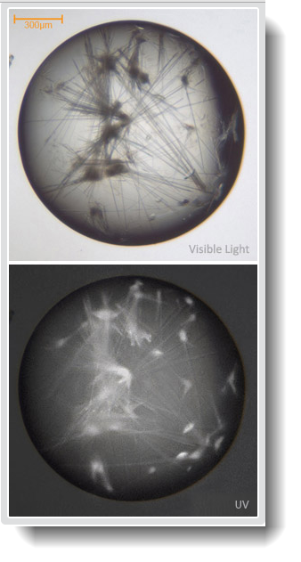

.. index:: UV Lightpath

.. _UV_imaging:

UV Imaging (Optional)
=====================

FORMULATRIX's ultraviolet (UV) imaging technology uses the fluorescence of tryptophan under UV light help you distinguish between protein and salt crystals and reveal crystals that may not be located
with visible light. Our UV solution uses 100% UV-optimized components, including UV-grade optics, a UV-sensitive camera, and UV lighting. 
ROCK IMAGER UV can be purchased as a retrofit for an existing ROCK
IMAGER or as an option on a new ROCK IMAGER.

**Optimized UV Epi-Illumination**

The UV LED and condenser lens is positioned to maximize the intensity of
the UV illumination to 35.7 uW/mm2 in order to boost the protein
fluorescence signal strength.

**Zoom Options**

ROCK IMAGER UV comes in two zoom options: **Fixed Zoom** and **Compound
Zoom**. The Fixed Zoom option is available with either a 2.5x, 5.0x or
7.0x objective. The Compound Zoom option includes all three lenses on a
motorized wheel.

**Single Light Path vs. Dual Light Path**

UV imaging is available as a single optical pathway can be used for both
visible and UV imaging. Advanced UV imaging leverages separate,
optimized optical paths for visible and UV imaging. The visible optical
pathway is independent from UV imaging so there is no compromise in
image quality or features. For specific information about each of the
light paths and objectives, refer to the tables below.

Single Light Path Visible and UV Optical Specifications
~~~~~~~~~~~~~~~~~~~~~~~~~~~~~~~~~~~~~~~~~~~~~~~~~~~~~~~

+-------------+-------------+-------------+-------------+-------------+
| Objective   | Effective   | Depth of    | Field of    | Working     |
|             | NA          | Field (mm)  | View (mm)   | Distance    |
|             |             |             |             | (mm)        |
+=============+=============+=============+=============+=============+
| 1.5x        | 0.06        | 4.5         | 3.6 x 2.7   | 5.8         |
| (Visible    |             |             |             |             |
| only)       |             |             |             |             |
+-------------+-------------+-------------+-------------+-------------+
| 2.9x        | 0.30        | 2.3         | 1.8 x 1.3   | 2.7         |
| (Visible    |             |             |             |             |
| and UV)     |             |             |             |             |
+-------------+-------------+-------------+-------------+-------------+
| 9.5x        | 0.32        | 0.7         | 1.3 x 1.0   | 8.5         |
| (Visible    |             |             |             |             |
| and UV)     |             |             |             |             |
+-------------+-------------+-------------+-------------+-------------+

Dual Light Path UV Optical Specifications
~~~~~~~~~~~~~~~~~~~~~~~~~~~~~~~~~~~~~~~~~

========= ==== =================== ================== ===============
Objective NA   Depth of Field (mm) Field of View (mm) Pixel Size (μm)
========= ==== =================== ================== ===============
2.5x      0.42 0.15                3.6 x 2.7          2.58
5.0x      0.32 0.07                1.8 x 1.3          1.29
7.0x      0.40 0.02                1.3 x 1.0          0.93
========= ==== =================== ================== ===============

Click here `to download UV GUIDE Reference <../_static/UV_Guide.pdf>`__ .

click here to read the `ROCK MAKER Webhelp <http://help.formulatrix.com/rock-maker/3.17>`_

|

Related Topics
^^^^^^^^^^^^^^

-  :ref:`UV_Absorption`
-  :ref:`UV_Compatible`
-  :ref:`UV_Lightpath`
-  :ref:`Optics_and_Camera_Control_Panel`
-  :ref:`Well_Control_Panel`
-  :ref:`Viewing_a_Plate`

.. toctree::
   :titlesonly:
   :hidden:

   /Content/UV_Absorption_Imaging
   /Content/UV_light_Path
   /Content/UV_Compatible_Plates
   /Content/UV_FAQs

..
   list of substitution definition

